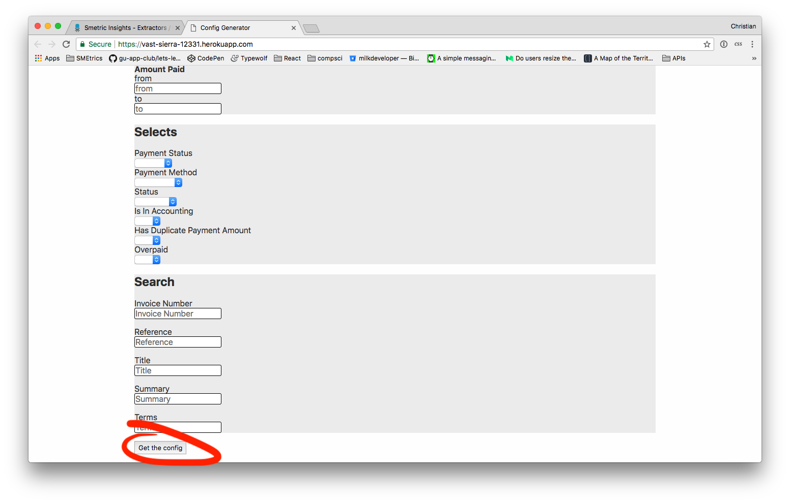
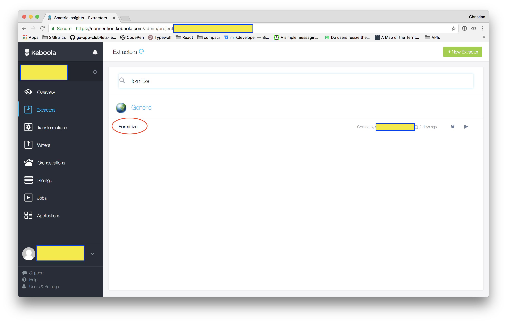
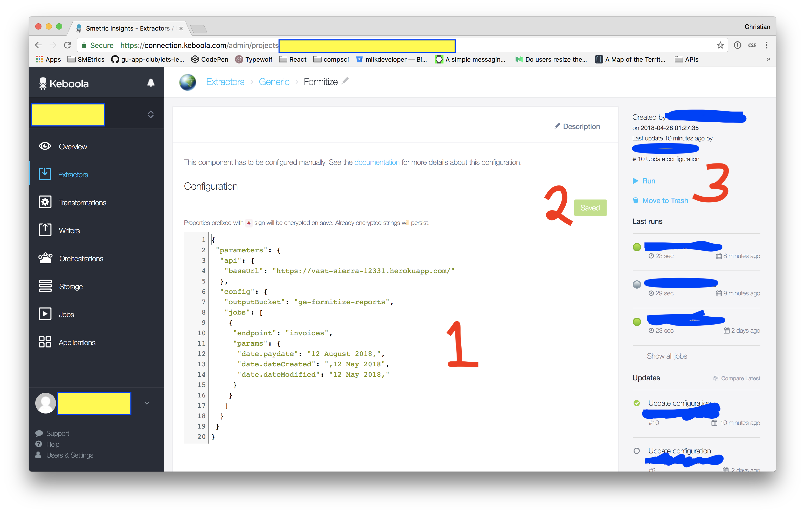
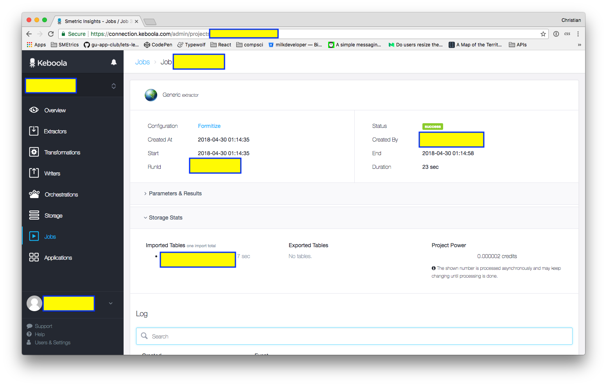

# Keboola Formitize CSV fetching extension

> Maintained by [Christian Scott](me@christianfscott.com)

REST API for interfacing with Keboola Generic Extension. Hosted at https://vast-sierra-12331.herokuapp.com/.

Currently only supports querying the `/crm/reports` 'invoices' tab, but extension is relatively easy.


## Usage

1. Grab a config JSON from the [home page](https://vast-sierra-12331.herokuapp.com/):

2. Paste config into the text box


3. Hit 'save'
4. Hit 'run' and confirm
5. Wait for up to 30 seconds. The light should go green, and then the data will be in the bucket you specified in the config


## Configuration

Use the config generator on [the home page](https://vast-sierra-12331.herokuapp.com/) to create config JSON for the keboola generic extractor.

## Extending

TODO ;)

## Running locally

To run this, you'll need `Python 3.6` (or greater) and `pipenv` installed. Example workflow below:

```shell
$ pipenv install
...

$ pipenv shell
...

(pipenv-shell) $ heroku local # or gunicorn app:app --logging-file=-
```

`Pipenv` automatically installs dependencies and the correct version of the Python interpreter.

This should "just work" on Windows, but if it doesn't, try `pip` instead:

```
$ pip install -r requirements.txt
$ python main.py
```

Make sure that pip & python both point to the Python 3.6 (or greater) version.

## Deployment

Pushing to Heroku is as simple as this:

```
$ git add .
$ git commit -m "<description>"
$ git push heroku master
```

You'll need to be signed in to heroku for this.

## Documentation

- https://docs.python.org/3/using/windows.html
- https://docs.pipenv.org/
- https://developers.keboola.com/extend/generic-extractor/
